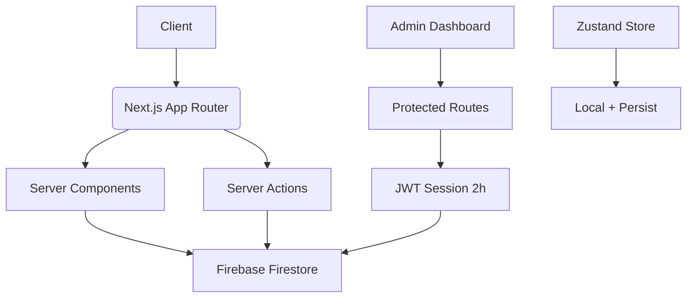

# Rahal Tourism Site

[](https://rahal-tourism-site.vercel.app)
[](https://nextjs.org)
[](.)
[](https://firebase.google.com)
[](https://tailwindcss.com)
[](LICENSE)


A modern, **multilingual tourism platform** for browsing, booking, and managing travel experiences with a **secure admin dashboard**.

---

## Description

**Rahal Tourism Site** is a fully-featured **Next.js 14** application designed to showcase and manage travel packages for an Egyptian tourism business. The platform allows customers to:

- Browse trips organized by categories in **English** and **Arabic**
- View detailed trip information with rich media (images, itineraries, inclusions)
- Book trips with personal and payment details
- Submit contact inquiries

Administrators can securely manage the entire catalog through a **dedicated dashboard** to:

- Create, edit, and delete categories and trips
- View and manage customer orders
- Handle inquiries

Built with a strong focus on **user experience**, **accessibility**, and **internationalization (i18n)**, Rahal provides a seamless experience for both customers and administrators.

---

---

## Features

### Public-Facing Features

- **Bilingual Support**: Full **English/Arabic** interface with **RTL layout** support
- **Trip Catalog**: Browse trips by category with **filtering** and **search**
- **Booking System**: Complete end-to-end booking flow with guest details
- **Payment Processing**: Support for **bank transfer** and **e-wallet** payments
- **Contact Form**: Structured inquiry submission with **locale-aware validation**
- **Responsive Design**: Works flawlessly on **mobile, tablet, and desktop**
- **Dynamic Content**: Stats section with **animated counters**

### Admin Dashboard Features

- **Authentication**: Secure **2-hour session-based login**
- **Category Management**: Create, edit, delete trip categories
- **Trip Management**: Full **CRUD** operations with rich metadata (images, pricing, itinerary)
- **Order Management**: View and track all customer bookings
- **Mobile-Responsive Admin UI**: Works on all device sizes

### Technical Features

- **Type Safety**: Full **TypeScript** implementation
- **Form Validation**: **Zod** schemas with locale-aware error messages
- **State Management**: **Zustand** for global state (e.g., booking flow) with persistence
- **Firebase Integration**: **Firestore** for real-time data storage
- **Server Actions**: Secure data mutations with **Next.js Server Actions**
- **Middleware Protection**: Authenticated routes for admin areas
- **SEO Optimized**: Proper metadata and structured content

## Architecture Overview

## Architecture Overview



- **Frontend**: Next.js App Router + Server Components
- **Backend**: Firebase Firestore + Server Actions
- **Auth**: Session-based (2h) with encrypted JWT
- **State**: Zustand (client + `persist` middleware)
- **Deployment**: Vercel (Edge + Serverless)

---

## Technologies Used

### Frontend

| Technology                  | Purpose                      |
| --------------------------- | ---------------------------- |
| **Next.js 14** (App Router) | Framework                    |
| **TypeScript**              | Type Safety                  |
| **Tailwind CSS**            | Styling with custom themes   |
| **Custom UI Components**    | Reusable design system       |
| **next-intl**               | Internationalization (i18n)  |
| **Zustand**                 | Lightweight state management |
| **React Hook Form + Zod**   | Form handling & validation   |
| **React Icons**             | Icon library                 |

### Backend & Infrastructure

| Technology             | Purpose                   |
| ---------------------- | ------------------------- |
| **Firebase Firestore** | Real-time NoSQL database  |
| **JWT-based Sessions** | Admin authentication      |
| **Vercel**             | Deployment & optimization |
| **.env.local**         | Environment management    |

### Development & Testing

| Tool          | Purpose                                      |
| ------------- | -------------------------------------------- |
| **ESLint**    | Code linting                                 |
| **Prettier**  | Code formatting                              |
| **Storybook** | Component documentation (e.g., Button)       |
| **Zod**       | Runtime validation with Egyptian phone regex |

---

## Installation and Setup

### Prerequisites

- **Node.js v18 or higher**
- **npm** or **yarn**
- **Firebase project** with **Firestore** enabled

### Steps

1. **Clone the repository**

   ```bash
   git clone https://github.com/your-username/rahal-tourism-site.git
   cd rahal-tourism-site
   ```

2. **Install dependencies**

   ```bash
   npm install
   # or
   yarn install
   ```

3. **Set up environment variables**  
   Create `.env.local` in the root directory:

   ```env
   # Firebase Configuration
   NEXT_PUBLIC_FIREBASE_API_KEY=your_api_key
   NEXT_PUBLIC_FIREBASE_AUTH_DOMAIN=your_project_id.firebaseapp.com
   NEXT_PUBLIC_FIREBASE_PROJECT_ID=your_project_id
   NEXT_PUBLIC_FIREBASE_STORAGE_BUCKET=your_project_id.appspot.com
   NEXT_PUBLIC_FIREBASE_MESSAGING_SENDER_ID=your_sender_id
   NEXT_PUBLIC_FIREBASE_APP_ID=your_app_id
   NEXT_PUBLIC_FIREBASE_MEASUREMENT_ID=your_measurement_id

   # Admin Authentication
   ADMIN_USERNAME=your_admin_username
   ADMIN_PASSWORD=your_admin_password
   SESSION_SECRET=your_strong_session_secret
   ```

   > **Warning**: Never commit `.env.local` — it's already in `.gitignore`

4. **Run the development server**

   ```bash
   npm run dev
   # or
   yarn dev
   ```

5. **Open your browser**  
   Visit [http://localhost:3000](http://localhost:3000)

---

## Usage

### Public Site

1. **Browse Trips**: Navigate through categories to explore available trips
2. **View Details**: Click "Show Details" to see itinerary, inclusions, and pricing
3. **Book a Trip**: Fill out the booking form with your details and preferred gathering place
4. **Complete Payment**: Choose your payment method and provide transaction details
5. **Contact Us**: Submit inquiries through the contact form

### Admin Dashboard

1. **Login**: Visit `/admin-login` and enter your credentials
2. **Manage Content**:
   - Create new categories under **"Create Category"**
   - Add trips under **"Create Trip"**
   - Edit or delete existing content from **"View"** pages
3. **Monitor Orders**: Track all bookings in the **"View Orders"** section

> **Note**: All admin actions require authentication and are protected by middleware.

---

## Roadmap

| Feature                                  | Status  |
| ---------------------------------------- | ------- |
| Direct online payments (Stripe / Paymob) | Planned |
| Email notifications on booking           | Planned |
| Admin analytics dashboard                | Planned |
| Mobile app (React Native)                | Planned |

---

## Need Help?

- **Live Demo**: [https://rahal-tourism-site.vercel.app](https://rahal-tourism-site.vercel.app)
- **Issue Tracker**: [https://github.com/your-username/rahal-tourism-site/issues](https://github.com/your-username/rahal-tourism-site/issues)
- **Email**: support@rahal.com
- **WhatsApp**: [+20 123 456 7890](https://wa.me/201234567890)

---

## Contributing

We welcome contributions! Here's how:

1. **Fork** the repository
2. **Create** your feature branch:
   ```bash
   git checkout -b feature/amazing-feature
   ```
3. **Commit** your changes:
   ```bash
   git commit -m 'Add amazing feature'
   ```
4. **Push** to the branch:
   ```bash
   git push origin feature/amazing-feature
   ```
5. **Open** a Pull Request

Please ensure your code follows existing patterns and includes tests where applicable.

---

## License

This project is licensed under the **MIT License** - see the [LICENSE](LICENSE) file for details.

```
MIT License

Copyright (c) 2025 Rahal Tourism

Permission is hereby granted, free of charge, to any person obtaining a copy
of this software and associated documentation files (the "Software"), to deal
in the Software without restriction, including without limitation the rights
to use, copy, modify, merge, publish, distribute, sublicense, and/or sell
copies of the Software, and to permit persons to whom the Software is
furnished to do so, subject to the following conditions:

The above copyright notice and this permission notice shall be included in all
copies or substantial portions of the Software.

THE SOFTWARE IS PROVIDED "AS IS", WITHOUT WARRANTY OF ANY KIND, EXPRESS OR
IMPLIED, INCLUDING BUT NOT LIMITED TO THE WARRANTIES OF MERCHANTABILITY,
FITNESS FOR A PARTICULAR PURPOSE AND NONINFRINGEMENT. IN NO EVENT SHALL THE
AUTHORS OR COPYRIGHT HOLDERS BE LIABLE FOR ANY CLAIM, DAMAGES OR OTHER
LIABILITY, WHETHER IN AN ACTION OF CONTRACT, TORT OR OTHERWISE, ARISING FROM,
OUT OF OR IN CONNECTION WITH THE SOFTWARE OR THE USE OR OTHER DEALINGS IN THE
SOFTWARE.
```

---

**Ready to deploy. Professional. Scalable. Beautiful.**

---
